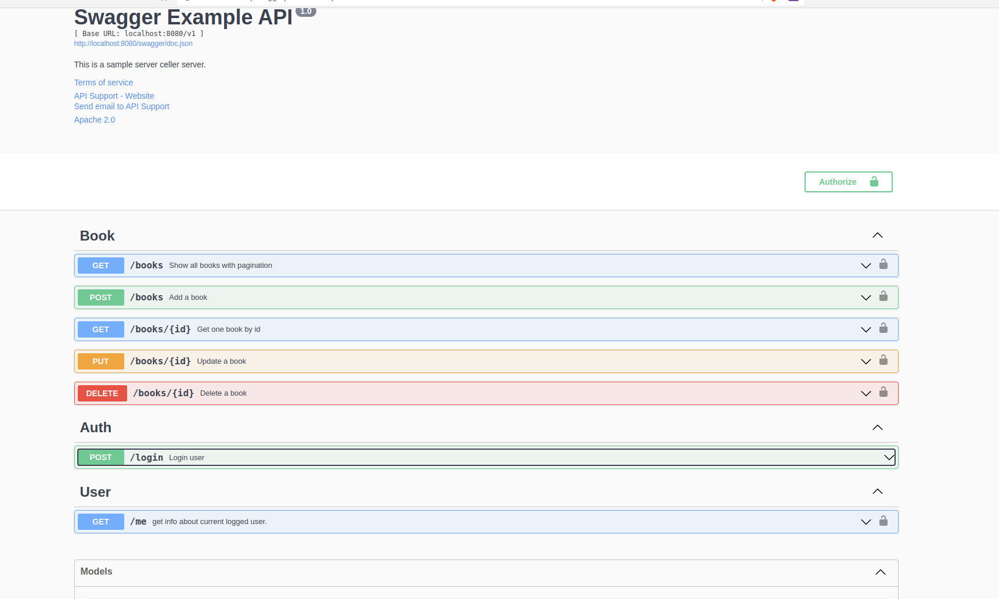

# gin-gorm-boilerplate
## Packages used:
    - Jwt authentification with github.com/appleboy/gin-jwt/v2 v2.8.0
    - Swagger documentation with github.com/swaggo/gin-swagger v1.4.0
    - Orm: github.com/jinzhu/gorm v1.22.5
    - Framework github.com/gin-gonic/gin v1.7.7
## Build app:
#### Copy and setup your env file: `cp .env.example .env`
#### Command for app build: `docker-compose up -d --build`

